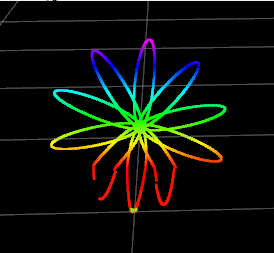

# Livox Simulation 
A package to provide plug-in for [Livox mid-40/mid-100 LiDAR](https://www.livoxtech.com/mid-40-and-mid-100). 

Mainly refer to repo: [ARTI-Robots/gazebo_utils](https://github.com/ARTI-Robots/gazebo_utils)

## Pattern

Since the principle of livox has not be public, the approximate pattern is taken.



## Usage
Before you write your urdf file by using this plugin, catkin_make/catkin build is needed.

A simple demo is shown in demo.launch

run 
```
    roslauch livox_simulation demo.launch
```
to see.

## Parameters

- min_range: 0.0  // min detection range
- max_range: 30.0  // max detection range
- resolution: 0.002  // 
- samples: // sample points in ellipses
- num_double_ellipses: 5 // number of 8-figures
- update_rate: 10  // Hz
- visualize: True // whether turn on visualize
- noise_mean: 0.0
- noise_stddev: 0.01
- topic_prefix: livox_lidar/
- rotation_increment: 0.1 // rotation_increment of every frame
